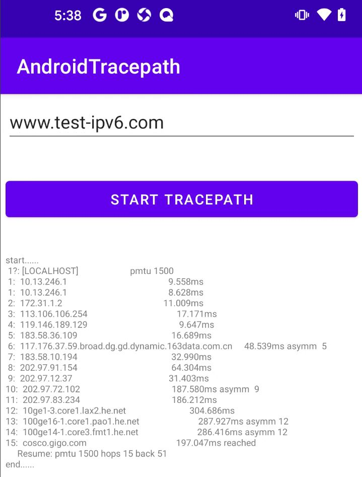

# android-tracepath

一个网络追踪并显示报文到达目的主机所经过的路由信息库，基于 platform/external/iputils/tracepath6.c 移植定制，无需特殊权限，兼容完美，适用于 Android 应用程序。

# 开始使用

# tracepath

Linux 的 tracepath 指令可以追踪数据到达目标主机的路由信息，同时还能够发现 MTU 值。它跟踪路径到目的地，沿着这条路径发现 MTU。它使用 UDP 端口或一些随机端口。它类似于 Traceroute，只是不需要超级用户权限，并且没有花哨的选项。

移植到 Android 应用层使用的 android-tracepath 库与 Linux 直接执行 tracepath 指令的输出结果格式类似，具体含义参见 tracepath 命令。